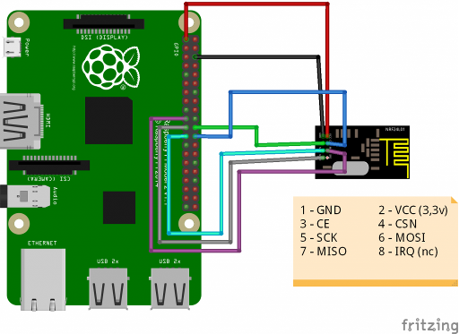

# Home Assistant Add-on: NRF24L01Bridge-v2

This addon tested with Raspberry PI 3 32bit, Raspberry PI 4 64bit

## Installation

Follow these steps to get the add-on installed on your system:

1. Uncomment dtparam=spi=on in /mnt/boot/config.txt and reboot.
2. Navigate in your Home Assistant frontend to **Supervisor** -> **Add-on Store**.
3. Find the "MRF24L01 Bridge v2" add-on and click it.
4. Click on the "INSTALL" button.

## How to use

The add-on has a couple of options available. To get the add-on running:

1. Start the add-on.
2. Have some patience and wait a couple of minutes.
3. Check the add-on log output to see the result.


If you have old NRF24L01Bridge settings available, remove this old integration and restart Home Assistant to see the new one.

## Configuration

Add-on configuration:

```yaml
"CE": 25,
"SPI_DEV": 0,
"MQTT_READ_TOPIC": "nrf24/read",
"MQTT_WRITE_TOPIC": "nrf24/write",
"MQTT_STATUS_TOPIC": "nrf24/status",
"RX_ADDRESS": "1Node",
"TX_STANDBY_INTERVAL": 5000,
"PAYLOAD_SIZE": 0,
"DATA_RATE": 2
```

MQTT_READ_TOPIC - topic to recieve message via NRF24

MQTT_WRITE_TOPIC - topic to send message via NRF24

MQTT_STATUS_TOPIC - topic of send status via NRF24

TX_STANDBY_INTERVAL - interval during retries, default 5000ms

RX address: 1Node

PAYLOAD_SIZE: 0 - dynamic, 8 - 8bit, 16 - 16bit, 32 - 32bit

DATA_RATE: 0 - 1mbps, 1 - 2mbps, 2 - 256kbps

## Example MQTT message

3Node: "text"

## Connection

https://github.com/yakhira/NRF24L01Bridge-v2/blob/master/Rpi_nrf24l01.png


